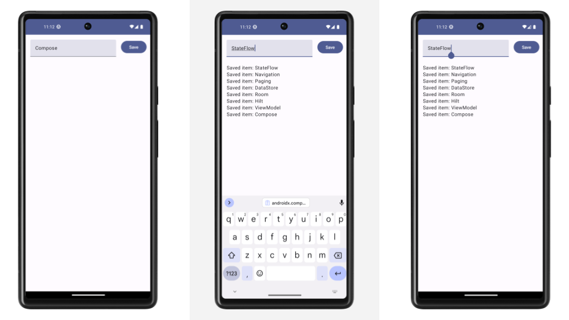

Android Architecture Starter Templates (beta)
==================

✅ **What it is**: A collection of templates featuring a layered architecture ready to be used in greenfield projects
or quick experiments, following the [Guide to app architecture](https://developer.android.com/topic/architecture).

🙅 **What it's not**: These templates are not designed to be educational code samples. For that, check out [Architecture Samples](https://github.com/android/architecture-samples), the [Now In Android sample](https://github.com/android/nowinandroid) or [Compose samples](https://github.com/android/compose-samples).

Templates are compatible with the latest **stable** version of Android Studio.

| Template  | Description |
| ------------- | ------------- |
| [`base`](https://github.com/android/architecture-templates/tree/base)  | Reactive architecture, Compose, database, single module  |
| [`multimodule`](https://github.com/android/architecture-templates/tree/multimodule)  | Base template + multimodule  |

## Screenshots



## Features

### 🖼️ UI
      
The app contains a simple Compose UI that shows a list of <br>
saved strings and lets the user save new ones.<br>
      
### 🧱 Build

* [KTS gradle files](https://docs.gradle.org/current/userguide/kotlin_dsl.html)
* [Version catalog](https://docs.gradle.org/current/userguide/platforms.html)

### 🏠 Architecture

* [Room Database](https://developer.android.com/training/data-storage/room)
* Dependency injection with [Hilt](https://developer.android.com/training/dependency-injection/hilt-android)
* [Jetpack ViewModel](https://developer.android.com/topic/libraries/architecture/viewmodel)
* UI using [Jetpack Compose](https://developer.android.com/jetpack/compose) and
[Material3](https://developer.android.com/jetpack/androidx/releases/compose-material3)
* [Jetpack Navigation](https://developer.android.com/jetpack/compose/navigation)
* [Reactive data layer](https://developer.android.com/topic/architecture/data-layer)
* [Kotlin Coroutines and Flow](https://developer.android.com/kotlin/coroutines)
* [Unit tests](https://developer.android.com/training/testing/local-tests)
* [UI tests](https://developer.android.com/jetpack/compose/testing) using fake data with
[Hilt](https://developer.android.com/training/dependency-injection/hilt-testing)

## Usage

1. Clone the repository, optionally choosing a branch and a target directory. For example, to check out the `base` branch:

```
git clone https://github.com/android/architecture-templates.git --branch base targetDirectory
```

For the customizer to work, dont open the project in Android Studio yet.

2. Run the customizer script:

```
bash customizer.sh your.package.name DataItemType [YourAppName]
```

* `your.package.name` is your app ID (should be lowercase)
* `DataItemType` is used for the name of the screen, exposed state and data base entity
(should be PascalCase).
* Optionally, you can specify a name for your application (should be in PascalCase).

Note: the customizer script requires bash 4 and above. You might have to install a modern version
on macOS:

```
brew install bash
```

# License

This code is distributed under the terms of the Apache License (Version 2.0). See the
[license](LICENSE) for more information.
