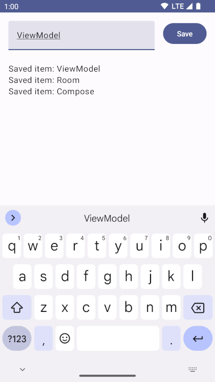

Android architecture starter templates
==================

A collection of templates featuring a layered architecture ready to be used in greenfield projects
or quick experiments.

Templates are compatible with the latest **stable** version of Android Studio.

## Features

The project contains an app with a simple UI that lets the user save items in a database and shows
a list of saved items, using the latest best practices.



### Build

* KTS gradle files
* Version catalog

### Architecture

* Room Database
* Dependency injection with [Hilt](https://developer.android.com/training/dependency-injection/hilt-android)
* [Room](https://developer.android.com/training/data-storage/room) database
* [Jetpack ViewModel](https://developer.android.com/topic/libraries/architecture/viewmodel)
* UI using [Jetpack Compose](https://developer.android.com/jetpack/compose) and
[Material3](https://developer.android.com/jetpack/androidx/releases/compose-material3)
* [Jetpack Navigation](https://developer.android.com/jetpack/compose/navigation)
* [Reactive data layer](https://developer.android.com/topic/architecture/data-layer)
* [Kotlin Coroutines and Flow](https://developer.android.com/kotlin/coroutines)
* [Unit tests](https://developer.android.com/training/testing/local-tests)
* [UI tests](https://developer.android.com/jetpack/compose/testing) using fake data with
[Hilt](https://developer.android.com/training/dependency-injection/hilt-testing)

## Usage

1. Clone the repository, choosing a branch. For example, to check out the `base` branch:

```
git clone https://github.com/android/architecture-templates.git --branch base
```

2. Run the customizer script:

```
./customizer.sh your.package.name DataItemType [YourAppName]
```

* `your.package.name` is your app ID (should be lowercase)
* `DataItemType` is used for the name of the screen, exposed state and data base entity
(should be PascalCase).
* Optionally, you can specify a name for your application (should be in PascalCase).

Note: the customizer script requires bash 4 and above. You might have to install a modern version
on macOS:

```
brew install bash
```

## Branches

* *`base`* - single-module reactive architecture with a Room database

```
git clone https://github.com/android/architecture-templates.git --branch base
```

* *`multimodule`* - multi-module reactive architecture with a Room database, following the
[modularization guide](https://developer.android.com/topic/modularization)

```
git clone https://github.com/android/architecture-templates.git --branch multimodule
```

# License

Now in Android is distributed under the terms of the Apache License (Version 2.0). See the
[license](LICENSE) for more information.
